# User Journey Documentation

## Application Purpose

Chat Overlay Widget is a Tauri v1.8 desktop application that wraps Claude Code's CLI terminal in a polished GUI. It bridges GUI input to a real PTY shell via node-pty (ConPTY), renders terminal output via xterm.js, and communicates between the webview UI and the Node.js sidecar backend over WebSocket. Built for a single user on Windows 11.

## Architecture Overview

```
Tauri Shell (Rust, main.rs)
  |-- spawns Node.js Sidecar (server.ts)
  |     |-- node-pty (ConPTY) sessions
  |     |-- WebSocket server (ws)
  |     |-- HTTP REST API (auth-gated)
  |     |-- SQLite session history (better-sqlite3)
  |     |-- MCP server mode (mcp-server.ts)
  |
  |-- hosts WebView2 (React + Vite)
        |-- PaneContainer (layout root)
        |-- TerminalPane (xterm.js + ChatInputBar)
        |-- AppHeader (window controls, mode toggles)
        |-- AgentSidebar (event timeline + PM chat)
        |-- Overlay (SVG annotation layer)
```

---

## Journey 1: Core Terminal Interaction

**Goal:** User types a command in the GUI input bar, it executes in the underlying shell, and output renders in the terminal emulator.

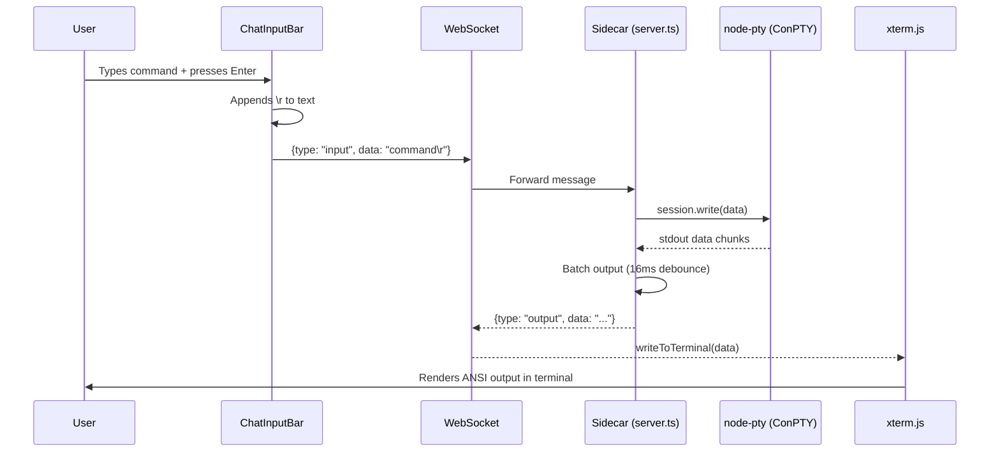

**Key files:**
- `src/components/ChatInputBar.tsx` -- GUI input textarea, Enter sends, Shift+Enter newline
- `src/components/TerminalPane.tsx` -- orchestrates terminal + input + sidebar panels
- `src/hooks/useWebSocket.ts` -- WebSocket client with auto-reconnect
- `src/hooks/useTerminal.ts` -- xterm.js Terminal instance + FitAddon
- `sidecar/src/server.ts` -- WebSocket message handler, PTY session management
- `sidecar/src/batchedPtySession.ts` -- output batching (16ms debounce)
- `sidecar/src/ptySession.ts` -- raw PTY spawn + SQLite history recording

**Success criteria:** Command output appears in terminal. Shell prompt returns after execution.

**Edge cases / failure modes:**
- WebSocket disconnects: auto-reconnect with exponential backoff (useWebSocket)
- PTY process exits: auto-respawn after 1 second (TerminalPane effect)
- Shell not found: error message written to terminal
- Sidecar crash: Tauri cleanup via taskkill /T /F (main.rs RunEvent::Exit)

---

## Journey 2: Application Startup

**Goal:** User launches the app, sidecar starts, WebSocket connects, shell spawns automatically.

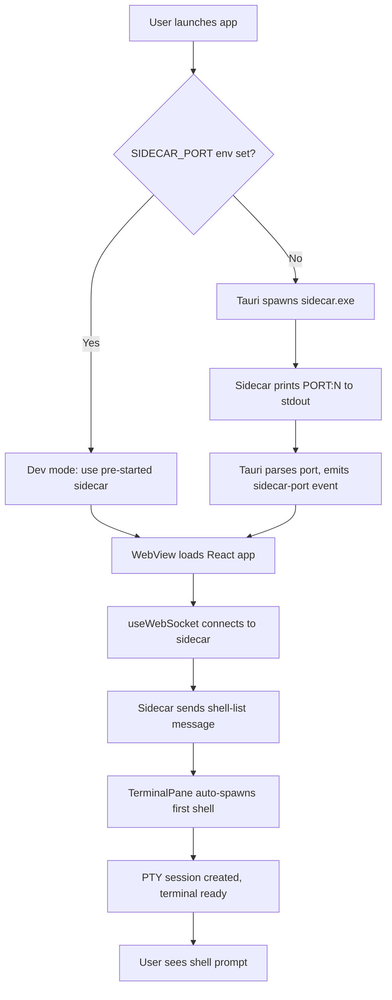

**Key files:**
- `src-tauri/src/main.rs` -- sidecar spawn, port discovery, exit cleanup
- `sidecar/src/server.ts` -- HTTP+WS server on random port, auth token generation
- `sidecar/src/shellDetect.ts` -- detects available shells (PowerShell, cmd, Git Bash)
- `sidecar/src/discoveryFile.ts` -- writes api.port file for external MCP discovery
- `src/hooks/useWebSocket.ts` -- connects to sidecar port via Tauri invoke

**Success criteria:** User sees a working shell prompt within 2-3 seconds of app launch.

**Edge cases / failure modes:**
- Windows Defender scans caxa binary: delays startup (mitigated by env vars)
- Port conflict: sidecar uses port 0 (OS assigns free port)
- Orphaned sessions from prior crash: SQLite markOrphans() on startup

---

## Journey 3: Multi-Pane Terminal Layout

**Goal:** User splits the terminal into multiple panes for parallel work.

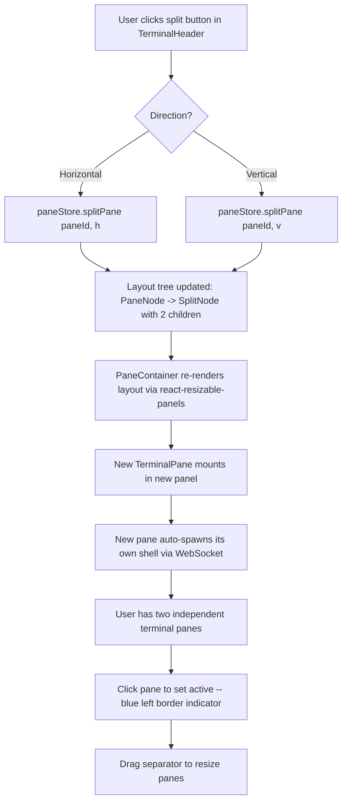

**Key files:**
- `src/store/paneStore.ts` -- layout tree (LayoutNode/SplitNode/PaneNode), split/close/resize
- `src/components/PaneContainer.tsx` -- renders layout tree via react-resizable-panels Group/Panel/Separator
- `src/components/SafePane.tsx` -- error boundary wrapper per pane
- `src/hooks/usePaneDimming.ts` -- dims inactive panes (flag-gated)

**Success criteria:** Up to 4 panes visible, each with independent shell. Active pane has blue left border. Separator drag resizes panes.

**Edge cases / failure modes:**
- Max 4 panes enforced (canSplit check)
- Cannot close last pane (canClose check)
- Narrow window (<600px): panes stack vertically automatically (adaptive layout)

---

## Journey 4: Session History Replay

**Goal:** User reviews output from a previous terminal session.

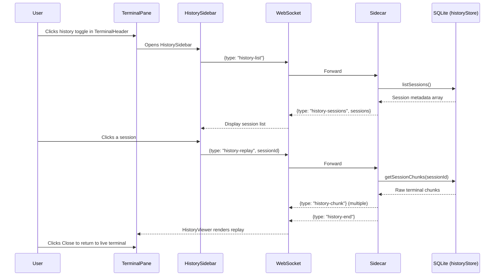

**Key files:**
- `src/hooks/useSessionHistory.ts` -- session list fetching, replay state
- `src/components/HistorySidebar.tsx` -- session list UI
- `src/components/HistoryViewer.tsx` -- replay rendering
- `sidecar/src/historyStore.ts` -- SQLite CRUD for session + chunk records

**Success criteria:** User can browse past sessions by timestamp/shell, view full terminal output, then return to live terminal.

---

## Journey 5: External Window Capture

**Goal:** User captures a screenshot of another application window and injects it as context for Claude Code.

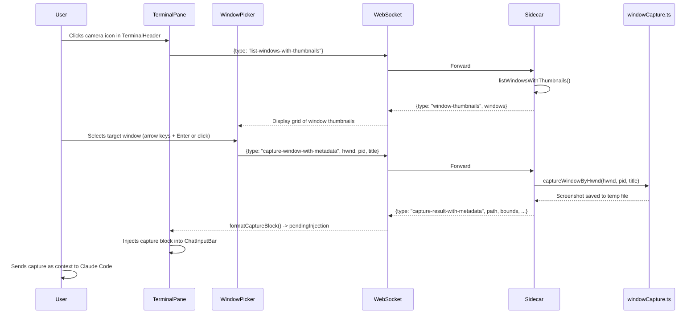

**Key files:**
- `src/components/WindowPicker.tsx` -- grid UI with search, keyboard nav, thumbnails
- `sidecar/src/windowEnumerator.ts` -- Win32 EnumWindows to list visible windows
- `sidecar/src/windowCapture.ts` -- Win32 PrintWindow / BitBlt screenshot
- `sidecar/src/windowThumbnailBatch.ts` -- batch thumbnail generation
- `src/utils/formatCaptureBlock.ts` -- formats screenshot metadata for CLI injection

**Success criteria:** Screenshot file created, capture block injected into input bar with path and metadata. Claude Code receives the image context.

**Edge cases / failure modes:**
- Feature flag `externalWindowCapture` must be enabled
- Minimized windows may fail capture (PrintWindow limitation)
- DPI scaling: captureSize and dpiScale included in metadata

---

## Journey 6: Walk Me Through Mode

**Goal:** An LLM agent guides the user step-by-step through a task, with visual annotations and automatic advancement.

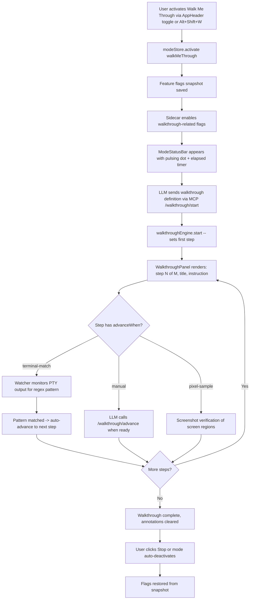

**Key files:**
- `src/components/ModePanel.tsx` -- Walk Me Through / Work With Me toggle buttons
- `src/store/modeStore.ts` -- mode lifecycle, flag snapshot/restore
- `sidecar/src/walkthroughEngine.ts` -- step progression, advanceWhen logic
- `sidecar/src/modeManager.ts` -- sidecar-side mode lifecycle, crash recovery
- `src/components/WalkthroughPanel.tsx` -- floating step indicator UI
- `src/components/Overlay.tsx` -- SVG annotation rendering (box, arrow, text, highlight)
- `sidecar/src/annotationStore.ts` -- annotation state with TTL expiry

**Success criteria:** User sees step-by-step instructions. Annotations highlight relevant UI areas. Steps advance automatically when conditions are met. Flags restore on deactivation.

**Edge cases / failure modes:**
- Mode is mutually exclusive: cannot activate Walk Me Through while Work With Me is active
- Crash recovery: sidecar persists mode state, sends recovery info on reconnect
- Flag snapshot ensures user's original feature flag state is restored

---

## Journey 7: Work With Me Mode (Agent Collaboration)

**Goal:** An LLM agent operates alongside the user, announcing actions before executing them, with the user able to cancel.

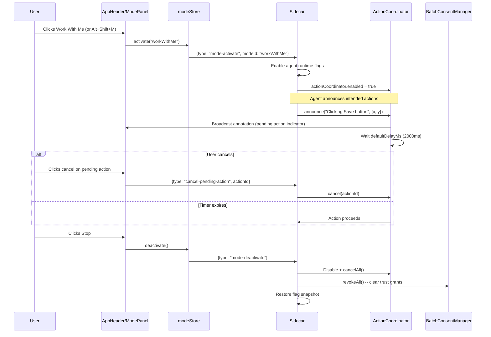

**Key files:**
- `sidecar/src/actionCoordinator.ts` -- announce-then-act protocol with delay
- `sidecar/src/batchConsentManager.ts` -- time-limited trust grants for automated actions
- `sidecar/src/modeManager.ts` -- mode lifecycle, flag management
- `sidecar/src/terminalWrite.ts` -- flag-gated terminal write for agent automation
- `sidecar/src/taskOrchestrator.ts` -- multi-step task execution

**Success criteria:** User sees what the agent intends to do before it happens. Cancel button works within the delay window. All trust grants revoked on mode exit.

---

## Journey 8: Git Diff Viewer

**Goal:** User views current git changes in a side panel with syntax highlighting and search.

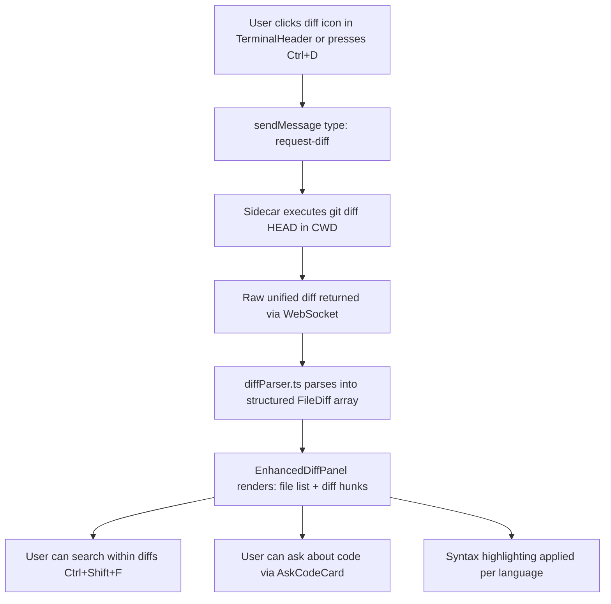

**Key files:**
- `sidecar/src/diffHandler.ts` -- executes `git diff HEAD` and returns raw output
- `src/lib/diffParser.ts` -- parses unified diff format into structured data
- `src/components/EnhancedDiffPanel.tsx` -- full diff viewer with file tree
- `src/components/DiffSearchBar.tsx` -- search within diff content
- `src/lib/diffSearch.ts` -- search logic across diff hunks
- `src/hooks/useSyntaxHighlight.ts` -- language-aware syntax highlighting
- `src/components/AskCodeCard.tsx` -- ask questions about selected code
- `sidecar/src/askCodeHandler.ts` -- processes code questions

**Success criteria:** Diff panel shows all changed files. Added/removed lines color-coded. Search highlights matches across files.

---

## Journey 9: Screenshot and Image Handling

**Goal:** User captures or pastes screenshots to provide visual context to Claude Code.

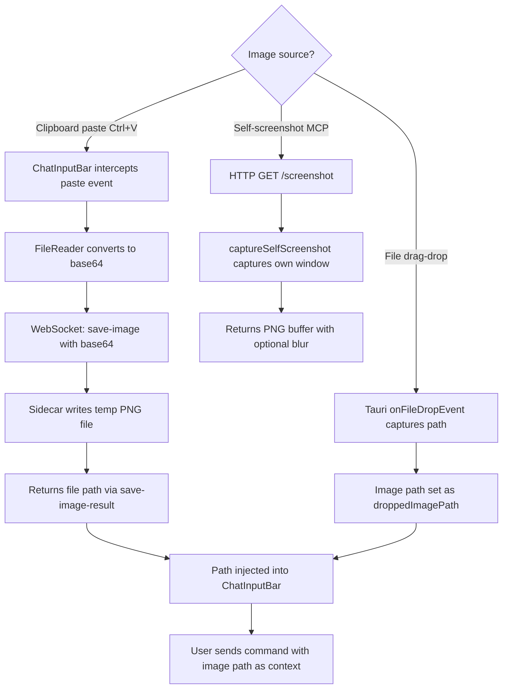

**Key files:**
- `src/components/ChatInputBar.tsx` -- paste handler, image path injection
- `src/components/PaneContainer.tsx` -- Tauri file drop listener
- `sidecar/src/screenshotSelf.ts` -- captures the app's own window
- `sidecar/src/secretScrubber.ts` -- best-effort secret scrubbing in terminal output
- `sidecar/src/ptySession.ts` -- saveImage() writes base64 to temp file

**Success criteria:** Image path appears in input bar. Claude Code can reference the screenshot file.

---

## Journey 10: Feature Flag Management

**Goal:** User enables/disables features at runtime without restarting.

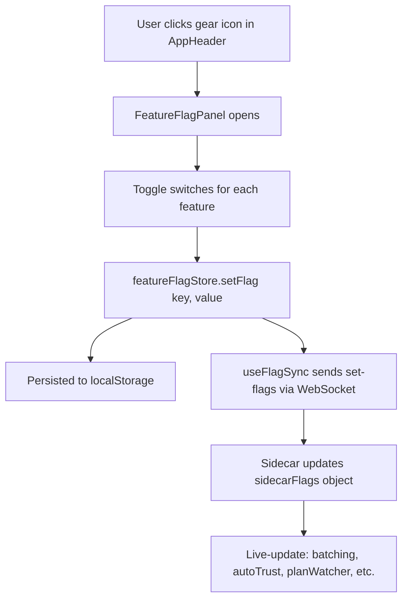

**Key files:**
- `src/components/FeatureFlagPanel.tsx` -- toggle UI for all feature flags
- `src/store/featureFlagStore.ts` -- 35+ feature flags with defaults and localStorage persistence
- `src/hooks/useFlagSync.ts` -- syncs frontend flag changes to sidecar via WebSocket
- `sidecar/src/server.ts` -- `set-flags` message handler with live-update logic

**Success criteria:** Flag toggle immediately affects behavior. Flags persist across app restarts via localStorage.

**Edge cases / failure modes:**
- Mode activation snapshots flags and restores on deactivation
- Safety-critical flags (autoTrust, consentGate) default to OFF

---

## Journey 11: MCP Tool Integration (External LLM Access)

**Goal:** External LLM agents (Claude Code CLI) interact with the running app via MCP tools.

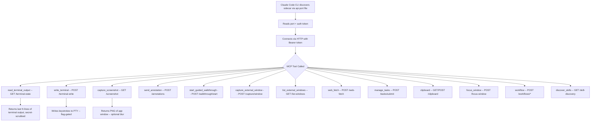

**Key files:**
- `sidecar/src/mcp-server.ts` -- MCP stdio transport server (launched via `sidecar mcp` subcommand)
- `sidecar/src/discoveryFile.ts` -- writes %APPDATA%/chat-overlay-widget/api.port for external discovery
- `sidecar/src/server.ts` -- HTTP REST endpoints with Bearer auth
- `sidecar/src/terminalBuffer.ts` -- ring buffer for terminal state queries
- `sidecar/src/secretScrubber.ts` -- scrubs secrets from MCP-exposed terminal output
- `sidecar/src/terminalWrite.ts` -- flag-gated PTY write for automation

**Success criteria:** Claude Code CLI can read terminal output, send commands, take screenshots, and guide walkthroughs -- all via authenticated HTTP/MCP.

**Edge cases / failure modes:**
- Auth token is 32-byte random hex, checked on every HTTP request
- Most MCP tools are feature-flag-gated (must be enabled explicitly)
- Discovery file cleaned up on exit (Tauri main.rs deletes before taskkill)
- Secret scrubbing is best-effort (X-Scrub-Warning header)

---

## Journey 12: Bookmark Bar and Prompt History

**Goal:** User saves and reuses frequently used commands.

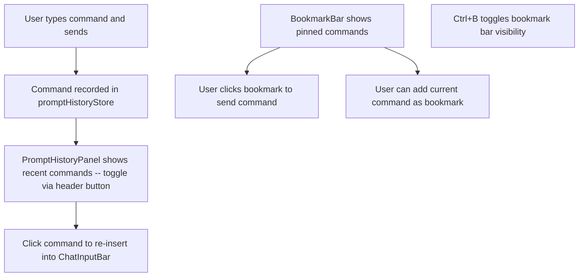

**Key files:**
- `src/store/promptHistoryStore.ts` -- persisted command history
- `src/components/PromptHistoryPanel.tsx` -- scrollable history list
- `src/store/bookmarkStore.ts` -- pinned command bookmarks
- `src/components/BookmarkBar.tsx` -- bookmark bar UI above input

**Success criteria:** Commands persist across sessions. One-click re-execution.

---

## Journey 13: Theme Customization

**Goal:** User switches visual theme for the terminal and UI.

**Key files:**
- `src/lib/themes.ts` -- theme definitions (colors, terminal options)
- `src/store/themeStore.ts` -- active theme state with localStorage persistence
- `src/components/ThemeSelector.tsx` -- theme picker UI

**Success criteria:** Theme applies to terminal background, text colors, and UI chrome. Persists across restarts.

---

## Journey 14: Agent Event Sidebar and PM Chat

**Goal:** User monitors LLM agent activity and has a side conversation with a local Ollama model.

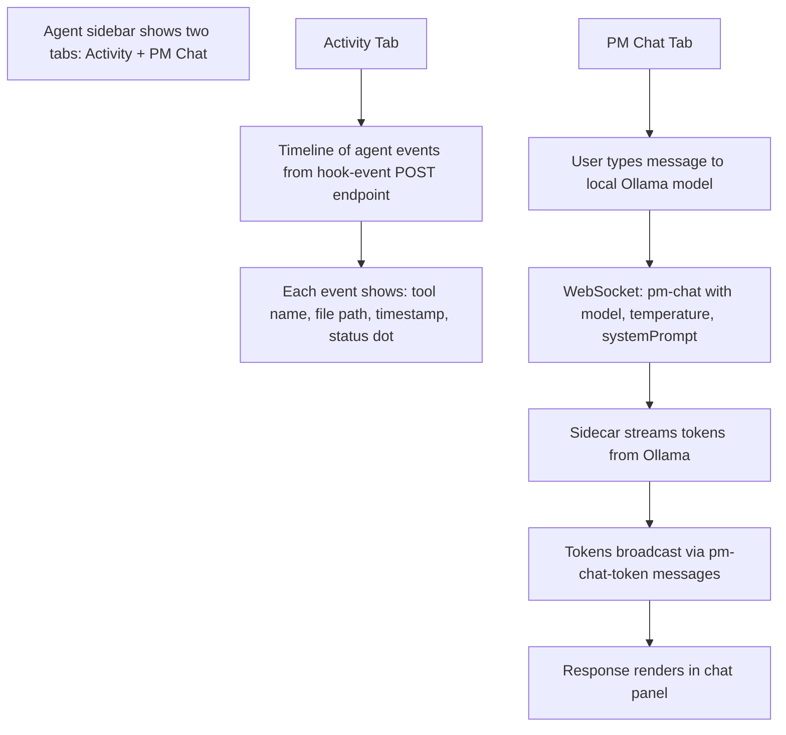

**Key files:**
- `src/components/AgentSidebar.tsx` -- collapsible sidebar with tab switching
- `src/store/agentEventStore.ts` -- event buffer with timeline state
- `src/components/PMChatTab.tsx` -- chat UI for Ollama conversations
- `src/store/pmChatStore.ts` -- chat message state, streaming state
- `sidecar/src/pmChat.ts` -- Ollama HTTP client with streaming
- `sidecar/src/agentEvent.ts` -- event normalization and buffering

**Success criteria:** Agent events appear in real-time as tool calls happen. PM chat streams responses token-by-token.

---

## Keyboard Shortcuts Reference

| Shortcut | Action | Scope |
|----------|--------|-------|
| Enter | Send command | ChatInputBar |
| Shift+Enter | New line in input | ChatInputBar |
| Escape | Focus input bar from terminal | Global (active pane) |
| Ctrl+F | Toggle terminal search | Active pane |
| Ctrl+D | Request git diff | Active pane |
| Ctrl+B | Toggle bookmark bar | Active pane |
| Alt+Shift+W | Toggle Walk Me Through mode | Global |
| Alt+Shift+M | Toggle Work With Me mode | Global |
| Ctrl+Wheel | Zoom terminal text | Terminal |

---

## Design Decisions

1. **PTY bridge over direct terminal embedding:** node-pty (ConPTY) ensures the CLI process cannot distinguish GUI input from real keyboard input. This is the core value proposition.

2. **Node.js sidecar over Rust PTY:** Tauri v1 webview has no Node.js runtime. node-pty requires Node.js. Solution: bundled Node.js sidecar via caxa, communicating over WebSocket.

3. **Feature flags for progressive disclosure:** 35+ features gated by runtime toggles. Safety-critical features (autoTrust, terminalWriteMcp, consentGate) default OFF. Users opt in explicitly.

4. **Mutually exclusive modes:** Walk Me Through and Work With Me cannot run simultaneously. Flag snapshot/restore prevents mode activation from permanently changing user preferences.

5. **Auth on every HTTP request:** Even though the app is local-only, a 32-byte random Bearer token prevents other local processes from controlling the terminal.

6. **Output batching (16ms debounce):** Prevents xterm.js render thrashing during high-throughput output (e.g., large file cats, build logs).

7. **Secret scrubbing is best-effort:** Terminal output exposed via MCP is scrubbed for common secret patterns, but this is not a security boundary (documented via X-Scrub-Warning header).
